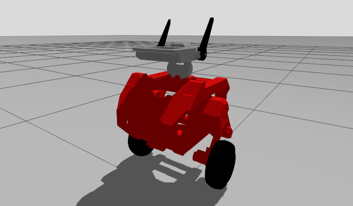

# **WBR:** Entretenimento

Trabalho de Interação Humano-Robô (IHR) apresentado ao Centro Universitário [FEI](https://portal.fei.edu.br/), como parte dos requisitos necessários para aprovação na disciplina de Interação Humano-Robô (IHR) (CCR230) do curso de Engenharia de Robôs, orientado pelo Prof. Dr. [Fagner de Assis Moura Pimentel](https://github.com/fagnerpimentel).

## Componentes do Grupo

- Caio Puertas Popolin Garcia
- Luis Augusto Ccopa Ibarra
- Nityananda Vianna Saraswati
- Priscila Cunha Vazquez
- Victor M O de Mello Ayres

## Resumo

O presente projeto apresenta o desenvolvimento de um robô autônomo de duas rodas, capaz de se equilibrar dinamicamente e interagir com usuários por meio de expressões visuais, gestos e movimentos corporais. O robô possui um design voltado para o entretenimento, destacando-se por sua estética fofa, com orelhas móveis, olhos animados exibidos em um display e LEDs no peito. Sua aplicação concentra-se na criação de experiências lúdicas e envolventes, proporcionando interações sociais atrativas para diferentes contextos de entretenimento.

## Introdução

Na sociedade contemporânea, a presença de robôs não se limita mais a ambientes industriais ou tarefas repetitivas: cresce a demanda por máquinas capazes de interagir de forma social, empática e lúdica. Robôs de entretenimento têm se consolidado como uma vertente importante, especialmente em áreas como educação, eventos, recepção e ambientes domésticos, onde a interação emocional e a experiência do usuário são tão relevantes quanto a funcionalidade técnica.

O robô proposto neste trabalho foi concebido com base nesse cenário. Trata-se de um robô autônomo de duas rodas, que se equilibra dinamicamente e apresenta um design cativante, inspirado em personagens de estética fofa e em robôs de entretenimento como os BDX da Disney. Ele conta com orelhas móveis, olhos animados exibidos em um display, LEDs no peito e movimentos de cabeça sincronizados às interações. Sua aplicação principal é o entretenimento por meio de expressões faciais, reatividade a gestos humanos e comportamento interativo, estabelecendo uma conexão emocional com o público.

O objetivo central do robô é proporcionar experiências interativas e envolventes através de um design expressivo e de respostas dinâmicas aos estímulos do usuário.

## Publico Alvo

No publico alvo deste trabalho estão inclusas:
- Crianças com imaginação
- Adultos que se encantam com entretenimento
- Nerds de tecnologia e ficção científica

### Personas

Três personas foram planejadas para este projeto. Elas englobam idades e perspectivas diferentes porém com um objetivo central de interatividade e entretenimento.

#### Persona primária 1: Enzo, uma criança imaginativa.

Enzo é uma criança de 8 anos curiosa e com uma vasta imaginação. Possui uma vida de classe média em um ambiente urbano, com forte contato com mídia de entretenimento infantil e cultura pop. É fã de Star Wars e de histórias fantásticas e acredita em figuras fictícias como Papai Noel.
Tem contato frequente com tecnologia, mas sem conhecimento aprofundado. Gosta de brincar de faz de conta com amigos do condomínio.
O objetivo da sua interação com o robô será vivenciar uma experiencia lúdica que reforce o seu mundo de fantasia, sem que a "magia" seja quebrada. Para tanto, as expectativas de Enzo sobre o robô são:
- Reaja a ações da criança, tanto verbais quanto não verbais (gestos, expressões).
- Movimente-se de forma autônoma pelo espaço sem colisões.
- Sirva como um “companheiro de brincadeiras”.

#### Persona primária 2: João, um adulto nostálgico.
Um trabalhador de classe média com 28 anos que cresceu em contato com a cultura geek/nerd e é fã de diversos personagens e universos fictícios porém consciente da distinção entre fantasia e realidade. Tem uma atitude descontraída e, no seu lazer, busca experiências lúdicas que gerem momentos de humor e fantasia semelhantes à sua infáncia. As suas expectativas com relação ao robô são:
- Reviver uma experiência mágica, de forma consciente e divertida, sem exigir uma imersão completa.
- O robô deve agir como um “bobo da corte tecnológico”, valorizando a leveza da experiência.
- As reações do robô devem ser espontâneas e engraçadas para não dependerem da imaginação do espectador.

#### Persona primária 3: Lucas, o nerd tecnófilo.
Lucas tem 21 anos de idade e está cursando ensino superior em uma área de tecnologia. Vive em uma classe média/alta em ambiente urbano com acesso a dispositivos eletrônicos, eventos geek e comunidades online. É um ávido consumidor de de cultura pop, fã de ficção científica e de universos tecnológicos. Aprecia tanto a fantasia quanto a inovação. As expectativas de Lucas sobre o robô são:
- O robô deve manter a imersão e encantamento da experiência.
- O robô precisa deixar claro o seu caráter inovador e tecnológico.
- O robô deve supreender o público pela integração do lúdico e as suas capacidades técnicas (movimentação autônoma, reconhecimento, interação responsiva).

### Mapa de empatia

#### Mapa de empatia de Enzo:

#### Mapa de empatia de João:

#### Mapa de empatia de Lucas:

## Contexto de uso

O robô proposto é voltado para ambientes de entretenimento e interação social, nos quais o aspecto lúdico é o elemento central. Seu design expressivo, aliado às capacidades de resposta autônoma, permite que ele seja utilizado em situações diversas, desde encontros informais até eventos organizados.

### Ambiente de interação

O robô é projetado para atuar em ambientes seguros e controlados, mas não totalmente determinísticos, como:
- Eventos temáticos.
- Exposições de robótica e tecnologia em centros universitários ou feiras.
- Espaços culturais e recreativos.

Esses ambientes apresentam circulação de pessoas, estímulos visuais variados e obstáculos que exigem que o robô seja capaz de se mover sem colisões, adaptando-se dinamicamente.

### Contextos sociais, econômicos e culturais

O público-alvo do robô abrange crianças, adultos nostálgicos e entusiastas de tecnologia, que compartilham alguns aspectos em comum:
- Social: procuram experiências de lazer e conexão social que envolvam imaginação, humor e inovação.
- Econômico: a experiência está inserida majoritariamente em um público de classe média/alta, com acesso a espaços de entretenimento, cultura digital e tecnologia.
- Cultural: há uma forte influência da cultura pop, da ficção científica, da cultura geek/nerd e da fantasia infantil. Filmes, jogos, séries e universos ficcionais servem de referência simbólica para a experiência com o robô.

### Informações que o robô deve saber antes de iniciar a tarefa

Para garantir uma interação fluida e coerente, o robô deve ter conhecimento prévio sobre aspectos do ambiente e do público:

#### Características do espaço físico:

- Localização de obstáculos fixos (paredes, móveis, barreiras).
- Presença de áreas de circulação intensa.
- Dimensões que permitam navegação sem colisão.

#### Condições de interação:

- Luminosidade (para funcionamento da câmera e expressividade dos LEDs).
- Contexto do evento (infantil, geek, tecnológico ou doméstico), de modo a ajustar o roteiro/“script” do personagem.

## Jornada do usuário

- Criar uma narrativa para o o seu robô e o usuário.
- Determine o passo a passo que o usuário realiza desde o primeiro até o último encontro com robô na realização da tarefa.
- O que está acontecendo com o ambiente quando o robô está interagindo com o usuário?
  - Descreva o que acontece ou pode acontecer passo a passo
  - Como a tarefa começa? Como a tarefa evolui? Como a tarefa termina?
- Enfatize todos os momentos em que acontece uma interação verbal, não-verbal e espacial.

### Estado inicial (Idle)
O robô está posicionado em um ambiente com várias pessoas.
Permanece em “modo de espera”, exibindo expressões curiosas nos olhos e movimentos sutis (como piscar e mexer levemente a cabeça/orelhas) para parecer “vivo” mesmo sem interação.

### Detecção de aproximação
O robô identifica que uma pessoa se aproximou dentro de um raio de 2 metros.
Sua expressão visual muda para indicar interesse (olhos passam a acompanhar a pessoa, orelhas se erguem, LEDs piscam).
Ele inicia um movimento suave em direção à pessoa, parando a cerca de 1 metro de distância.

### Início da interação
O robô estabelece contato “não-verbal” com a pessoa: olha diretamente, pisca, inclina a cabeça.
Se a pessoa faz um gesto (como acenar, estender a mão, abaixar-se), o robô responde com animações correspondentes (movimento de orelhas, LEDs piscando, movimentos do corpo).

### Exploração da interação
A interação evolui em ciclos curtos, sempre dependente da iniciativa da pessoa:
Gestos → robô reage de forma lúdica (aproximar, recuar, girar, inclinar cabeça).
Movimentação da pessoa → robô pode segui-la com a cabeça ou com o corpo dentro de um espaço delimitado.
O robô adapta suas reações de acordo com o ambiente: se há obstáculos, ele evita colisões; se há várias pessoas, mantém foco em apenas um usuário por vez.

### Manutenção do engajamento
Durante alguns minutos, o robô alterna reações espontâneas (piscar LEDs, balançar orelhas, girar levemente) com respostas ao usuário.
Caso perceba perda de atenção do usuário (ex.: a pessoa olha para outro lado ou se afasta), o robô diminui a intensidade das respostas.

### Encerramento da interação
Se a pessoa se afasta além de 2 metros, o robô entende que a interação terminou.
Ele retorna para o estado de idle: postura curiosa, buscando por alguém para interagir, expressões suaves.
Permanece atento a novos usuários que possam se aproximar.

## Análise de concorrência

- Pesquise robôs existentes atualmente que possam fazer a tarefa deste projeto.
- Selecione pelo menos 3 robôs diferentes que podem fazer essa tarefa.
- Em relação aos concorrentes, respondam as seguintes perguntas?
  - Existe plataforma similar que atende o mesmo mercado e funcionalidades? Se sim: Quais os pontos positivos? Quais os pontos negativos?
  - Existe plataforma diferente quanto ao serviço, mas que atenda esse mercado? Se sim: Quais os pontos positivos? Quais os pontos negativos?
  - Quais plataformas sua equipe acha mais interessantes? Qual a justificativa?

## Design

- Pense nas características de Affordances do seu robô. Que tipo de acessibilidades devem ser consideradas dentro do seu projeto?
- Discuta o papel das expectativas do usuário no projeto de um robô. Qual a importância e pontos a serem considerados se você quiser vender esse robô  seu robô?
- O seu robô tem um padrão com mais ou menos características antropomórficas? Qual padrão é mais aceito pela sociedade dentro do projeto que você está desenvolvendo?
- Quais o design mais apropriado para o robô deste projeto? Modele o seu robô com desenhos de formas primitivas (caixas, cilindros, esferas)

<!--  -->
<!--  -->

## Ações do robô

- Para cada ação:
  - Descreva a ação.
  - Determine os pré-requisitos para que a ação aconteça
  - Determine o que se espera que seja modificado no ambiente quando a ação é finalizada

## Interações do robô

### Espacial

- Para cada interação:
  - Descreva a interação.
  - Determine os pré-requisitos para que a interação aconteça
  - Determine espera de resposta emocional do usúario quando a interação é finalizada

### Verbal

- Para cada interação:
  - Descreva a interação.
  - Determine os pré-requisitos para que a interação aconteça
  - Determine espera de resposta emocional do usúario quando a interação é finalizada

### Não-verbal

- Para cada interação:
  - Descreva a interação.
  - Determine os pré-requisitos para que a interação aconteça
  - Determine espera de resposta emocional do usúario quando a interação é finalizada

[^1]: Fonte: Adaptado de <https://hazeshift.com.br/mapa-de-empatia/>

<!-- TODOs:
- Add exemplos
 -->
