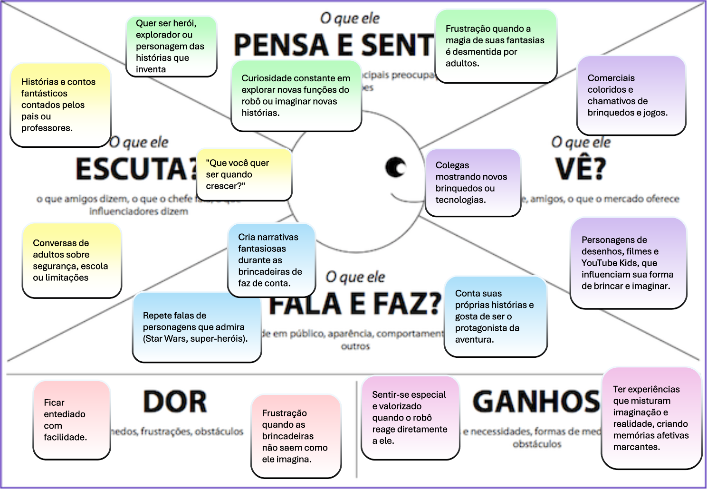
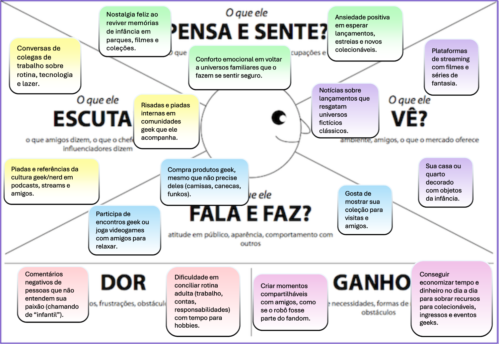
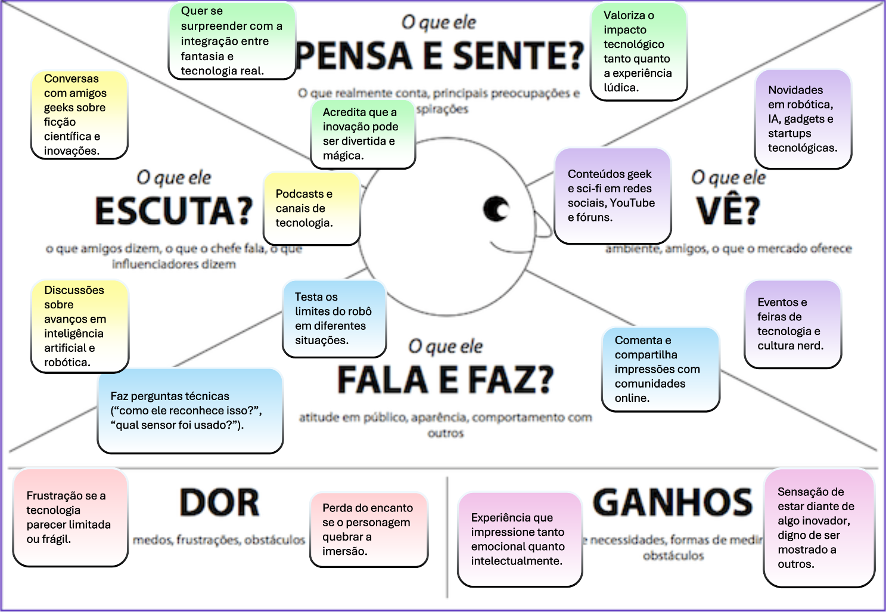
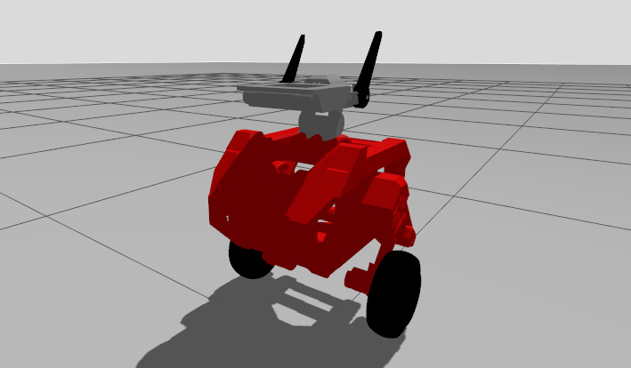

# **WBR:** Entretenimento

Trabalho de Interação Humano-Robô (IHR) apresentado ao Centro Universitário [FEI](https://portal.fei.edu.br/), como parte dos requisitos necessários para aprovação na disciplina de Interação Humano-Robô (IHR) (CCR230) do curso de Engenharia de Robôs, orientado pelo Prof. Dr. [Fagner de Assis Moura Pimentel](https://github.com/fagnerpimentel).

## Componentes do Grupo

- Caio Puertas Popolin Garcia
- Luis Augusto Ccopa Ibarra
- Nityananda Vianna Saraswati
- Priscila Cunha Vazquez
- Victor M O de Mello Ayres

## Resumo

O presente projeto apresenta o desenvolvimento de um robô autônomo de duas rodas, capaz de se equilibrar dinamicamente e interagir com usuários por meio de expressões visuais, gestos e movimentos corporais. O robô possui um design voltado para o entretenimento, destacando-se por sua estética fofa, com orelhas móveis, olhos animados exibidos em um display e LEDs no peito. Sua aplicação concentra-se na criação de experiências lúdicas e envolventes, proporcionando interações sociais atrativas para diferentes contextos de entretenimento.

## Introdução

Na sociedade contemporânea, a presença de robôs não se limita mais a ambientes industriais ou tarefas repetitivas: cresce a demanda por máquinas capazes de interagir de forma social, empática e lúdica. Robôs de entretenimento têm se consolidado como uma vertente importante, especialmente em áreas como educação, eventos, recepção e ambientes domésticos, onde a interação emocional e a experiência do usuário são tão relevantes quanto a funcionalidade técnica.

O robô proposto neste trabalho foi concebido com base nesse cenário. Trata-se de um robô autônomo de duas rodas, que se equilibra dinamicamente e apresenta um design cativante, inspirado em personagens de estética fofa e em robôs de entretenimento como os BDX da Disney. Ele conta com orelhas móveis, olhos animados exibidos em um display, LEDs no peito e movimentos de cabeça sincronizados às interações. Sua aplicação principal é o entretenimento por meio de expressões faciais, reatividade a gestos humanos e comportamento interativo, estabelecendo uma conexão emocional com o público.

O objetivo central do robô é proporcionar experiências interativas e envolventes através de um design expressivo e de respostas dinâmicas aos estímulos do usuário.

## Publico Alvo

No publico alvo deste trabalho estão inclusas:
- Crianças com imaginação
- Adultos que se encantam com entretenimento
- Nerds de tecnologia e ficção científica

### Personas

Três personas foram planejadas para este projeto. Elas englobam idades e perspectivas diferentes porém com um objetivo central de interatividade e entretenimento.

#### Persona primária 1: Enzo, uma criança imaginativa.

Enzo é uma criança de 8 anos curiosa e com uma vasta imaginação. Possui uma vida de classe média em um ambiente urbano, com forte contato com mídia de entretenimento infantil e cultura pop. É fã de Star Wars e de histórias fantásticas e acredita em figuras fictícias como Papai Noel.
Tem contato frequente com tecnologia, mas sem conhecimento aprofundado. Gosta de brincar de faz de conta com amigos do condomínio.
O objetivo da sua interação com o robô será vivenciar uma experiencia lúdica que reforce o seu mundo de fantasia, sem que a "magia" seja quebrada. Para tanto, as expectativas de Enzo sobre o robô são:
- Reaja a ações da criança, tanto verbais quanto não verbais (gestos, expressões).
- Movimente-se de forma autônoma pelo espaço sem colisões.
- Sirva como um “companheiro de brincadeiras”.

#### Persona primária 2: João, um adulto nostálgico.
Um trabalhador de classe média com 28 anos que cresceu em contato com a cultura geek/nerd e é fã de diversos personagens e universos fictícios porém consciente da distinção entre fantasia e realidade. Tem uma atitude descontraída e, no seu lazer, busca experiências lúdicas que gerem momentos de humor e fantasia semelhantes à sua infáncia. As suas expectativas com relação ao robô são:
- Reviver uma experiência mágica, de forma consciente e divertida, sem exigir uma imersão completa.
- O robô deve agir como um “bobo da corte tecnológico”, valorizando a leveza da experiência.
- As reações do robô devem ser espontâneas e engraçadas para não dependerem da imaginação do espectador.

#### Persona primária 3: Lucas, o nerd tecnófilo.
Lucas tem 21 anos de idade e está cursando ensino superior em uma área de tecnologia. Vive em uma classe média/alta em ambiente urbano com acesso a dispositivos eletrônicos, eventos geek e comunidades online. É um ávido consumidor de de cultura pop, fã de ficção científica e de universos tecnológicos. Aprecia tanto a fantasia quanto a inovação. As expectativas de Lucas sobre o robô são:
- O robô deve manter a imersão e encantamento da experiência.
- O robô precisa deixar claro o seu caráter inovador e tecnológico.
- O robô deve supreender o público pela integração do lúdico e as suas capacidades técnicas (movimentação autônoma, reconhecimento, interação responsiva).

### Mapa de empatia

#### Mapa de empatia de Enzo:

#### Mapa de empatia de João:

#### Mapa de empatia de Lucas:

## Contexto de uso

O robô proposto é voltado para ambientes de entretenimento e interação social, nos quais o aspecto lúdico é o elemento central. Seu design expressivo, aliado às capacidades de resposta autônoma, permite que ele seja utilizado em situações diversas, desde encontros informais até eventos organizados.

### Ambiente de interação

O robô é projetado para atuar em ambientes seguros e controlados, mas não totalmente determinísticos, como:
- Eventos temáticos.
- Exposições de robótica e tecnologia em centros universitários ou feiras.
- Espaços culturais e recreativos.

Esses ambientes apresentam circulação de pessoas, estímulos visuais variados e obstáculos que exigem que o robô seja capaz de se mover sem colisões, adaptando-se dinamicamente.

### Contextos sociais, econômicos e culturais

O público-alvo do robô abrange crianças, adultos nostálgicos e entusiastas de tecnologia, que compartilham alguns aspectos em comum:
- Social: procuram experiências de lazer e conexão social que envolvam imaginação, humor e inovação.
- Econômico: a experiência está inserida majoritariamente em um público de classe média/alta, com acesso a espaços de entretenimento, cultura digital e tecnologia.
- Cultural: há uma forte influência da cultura pop, da ficção científica, da cultura geek/nerd e da fantasia infantil. Filmes, jogos, séries e universos ficcionais servem de referência simbólica para a experiência com o robô.

### Informações que o robô deve saber antes de iniciar a tarefa

Para garantir uma interação fluida e coerente, o robô deve ter conhecimento prévio sobre aspectos do ambiente e do público:

#### Características do espaço físico:

- Localização de obstáculos fixos (paredes, móveis, barreiras).
- Presença de áreas de circulação intensa.
- Dimensões que permitam navegação sem colisão.

#### Condições de interação:

- Luminosidade (para funcionamento da câmera e expressividade dos LEDs).
- Contexto do evento (infantil, geek, tecnológico ou doméstico), de modo a ajustar o roteiro/“script” do personagem.

## Jornada do usuário

### Estado inicial (Idle)
O robô está posicionado em um ambiente com várias pessoas.
Permanece em “modo de espera”, exibindo expressões curiosas nos olhos e movimentos sutis (como piscar e mexer levemente a cabeça/orelhas) para parecer “vivo” mesmo sem interação.

### Detecção de aproximação
O robô identifica que uma pessoa se aproximou dentro de um raio de 2 metros.
Sua expressão visual muda para indicar interesse (olhos passam a acompanhar a pessoa, orelhas se erguem, LEDs piscam).
Ele inicia um movimento suave em direção à pessoa, parando a cerca de 1 metro de distância.

### Início da interação
O robô estabelece contato “não-verbal” com a pessoa: olha diretamente, pisca, inclina a cabeça.
Se a pessoa faz um gesto (como acenar, estender a mão, abaixar-se), o robô responde com animações correspondentes (movimento de orelhas, LEDs piscando, movimentos do corpo).

### Exploração da interação
A interação evolui em ciclos curtos, sempre dependente da iniciativa da pessoa:
Gestos → robô reage de forma lúdica (aproximar, recuar, girar, inclinar cabeça).
Movimentação da pessoa → robô pode segui-la com a cabeça ou com o corpo dentro de um espaço delimitado.
O robô adapta suas reações de acordo com o ambiente: se há obstáculos, ele evita colisões; se há várias pessoas, mantém foco em apenas um usuário por vez.

### Manutenção do engajamento
Durante alguns minutos, o robô alterna reações espontâneas (piscar LEDs, balançar orelhas, girar levemente) com respostas ao usuário.
Caso perceba perda de atenção do usuário (ex.: a pessoa olha para outro lado ou se afasta), o robô diminui a intensidade das respostas.

### Encerramento da interação
Se a pessoa se afasta além de 2 metros, o robô entende que a interação terminou.
Ele retorna para o estado de idle: postura curiosa, buscando por alguém para interagir, expressões suaves.
Permanece atento a novos usuários que possam se aproximar.

#  Análise de Concorrência

## Concorrente 1 – Mirokaï Explorer Suit (Enchanted Tools)
**Plataforma:** Similar (robô de interação e entretenimento, com design carismático e autonomia avançada).  

- **Pontos Positivos:**  
  - Design inspirado em personagens animados, alto apelo emocional.  
  - Navegação autônoma robusta (ball-bot com VSLAM).  
  - Conversação avançada com IA multimodal (voz, visão, emoção).  
  - Aplicações em hospitais, hotéis e eventos.  

- **Pontos Negativos:**  
  - Custo muito elevado (~U$30.000 + taxas).  
  - Grande porte, pouco prático para ambientes domésticos.  
  - Necessidade de manutenção profissional.

Sobre este concorrente, o que concluímos é que a cinematica e o controle são muito complexos por se tratar de um **ball-bot**, então para o tipo de ambiente que queremos implementá-lo se torna inviável. Apesar disso, a presença de um **LLM avançado para comunicação** é um ponto de destaque. Seria interessante considerar esse tipo de recurso para implementar conversação mais fluida no nosso projeto.

## Concorrente 2 – Robô Bípede de Entretenimento (Disney Research)
**Plataforma:** Similar (foco em entretenimento imersivo e carisma).  

- **Pontos Positivos:**  
  - Movimentos expressivos e naturais, transmitindo personalidade.  
  - Forte integração com storytelling e experiências imersivas.  
  - Pesquisa de ponta em equilíbrio bípede e expressividade.  

- **Pontos Negativos:**  
  - Não é comercializado (uso exclusivo da Disney).  
  - Restrito a parques e shows em ambientes controlados.  
  - Engenharia complexa, alto custo e manutenção difícil.
  - 
O que aprendemos com este concorrente: O controle por compensadores PID já se tornou uma técnica tradicional e antiga no mundo da robótica comtemporânea. A novidade introduzida pela Disney é o uso do aprendizado de máquina em ambientes virtuais como o Newton desenvolvido pela NVIDIA. A modelagem do robô no ambiente virtual permite o treinamento do robô de modo que ele mesmo encontre soluções para o próprio equilíbrio. Resultando em movimentações mais espontâneas e uma qualidade na reação melhorada. Alguns projetos de pesquisa da Disney incluem também modelos de caminhada estilizados que foram utilizados neste robô.

## Concorrente 3 – Vector (Anki / Digital Dream Labs)
**Plataforma:** Diferente (mais próximo de brinquedo inteligente e assistente doméstico).  

- **Pontos Positivos:**  
  - Preço acessível em comparação com outros robôs.  
  - Carisma forte através de expressões faciais animadas.  
  - Reconhecimento de rostos e integração com assistentes virtuais.  

- **Pontos Negativos:**  
  - Funcionalidades limitadas (sem braços, sem equilíbrio dinâmico).  
  - Autonomia baixa, depende de base de recarga frequente.  
  - Histórico de instabilidade da empresa (Anki → Digital Dream Labs).
    
O concorrente Vector se destaca pelo preço acessível e pelo apelo carismático, mas suas funcionalidades são limitadas. É mais próximo de um brinquedo inteligente do que de um robô imersivo. Mesmo assim, sua forma de expressividade facial e interação simples serve como referência para estratégias de design emocional que podem ser aproveitadas no nosso robô.

## Design

## Affordances do Robô  
O design do robô é inspirado em referências conhecidas da cultura pop, o que facilita a identificação e aproximação do usuário. Suas affordances (percepções de usabilidade transmitidas pelo design) devem priorizar:  
- **Olhos grandes e expressivos**, que comunicam estados emocionais (feliz, atento, curioso) e tornam a interação mais intuitiva.  
- **Orelhas laterais móveis**, que funcionam como indicadores visuais de reações (semelhantes a expressões corporais em animais).  
- **Corpo ovalado e rodas largas**, transmitindo estabilidade e segurança, reduzindo a percepção de risco de queda.  
- **Interface de fácil entendimento**, sem excesso de botões ou comandos ocultos, já que o próprio design sugere sua função lúdica e amigável.  

Esses elementos aumentam a acessibilidade ao projeto, permitindo que crianças, adultos e até pessoas sem familiaridade com tecnologia consigam interagir com o robô de forma natural.  

---

## Expectativas do Usuário  
As expectativas do usuário exercem papel central no design do robô. Pessoas tendem a esperar que robôs com **traços “fofos” e antropomórficos** sejam amistosos, responsivos e divertidos, enquanto robôs com aparência mecânica transmitem seriedade e eficiência. Para comercializar o projeto, é essencial alinhar **aparência** com **função**:  
- Se o robô tem um rosto expressivo, espera-se que ele **demonstre emoções e reaja socialmente**.  
- Se ele possui rodas largas, espera-se que seja **estável e ágil**.  
- A expectativa de “companheiro interativo” deve ser correspondida com respostas animadas, sons e expressões coerentes.  

Se essas expectativas não forem atendidas, pode haver frustração e rejeição do produto. Por isso, o design deve reforçar a ideia de **entretenimento acessível e confiável**.  

---

## Antropomorfismo no Projeto  
O robô apresenta **características parcialmente antropomórficas**: olhos, orelhas e torso lembram elementos humanos e animais, enquanto as rodas substituem as pernas. Esse **hibridismo** facilita a aceitação social, pois combina o “fofo” e familiar (olhos grandes, cabeça expressiva) com a praticidade mecânica (rodas, corpo simples).  

Na sociedade atual, robôs excessivamente humanos podem gerar estranhamento (efeito *uncanny valley*), enquanto robôs totalmente mecânicos podem parecer frios e distantes. O meio-termo, como o escolhido no projeto, costuma ser mais aceito em contextos de **entretenimento e interação social**.  

---

## Design Mais Apropriado  
O design mais adequado para o projeto é aquele que une **simplicidade construtiva** (formas geométricas básicas) e **expressividade visual**. Um modelo inicial pode ser representado por:  
- **Cabeça**: esfera ou elipse achatada, com olhos circulares grandes.  
- **Orelhas**: cilindros ou semiesferas laterais, articuláveis.  
- **Torso**: ovalado (elipsoide), transmitindo suavidade e estabilidade.  
- **Rodas**: dois cilindros grandes nas laterais inferiores, substituindo as pernas.  
- **Pescoço**: cilindro fino que conecta o torso à cabeça, permitindo movimentos.  

Esse uso de **formas primitivas (caixas, cilindros, esferas)** facilita tanto a prototipagem física quanto a modelagem digital, mantendo um estilo coerente com a proposta lúdica do robô.  

# Modelos das Peças Individuais do Robô

- [Acessar pasta completa das meshes](wbr/meshes)

## Peças individuais

- [Chassi_Tcc_2.stl](wbr/meshes/Chassi_Tcc_2.stl) 
- [Chassi_Tcc_cabecc.stl](wbr/meshes/Chassi_Tcc_cabecc.stl) 
- [Chassi_Tcc_orelha_dir.stl](wbr/meshes/Chassi_Tcc_orelha_dir.stl) 
- [Chassi_Tcc_orelha_esq.stl](wbr/meshes/Chassi_Tcc_orelha_esq.stl) 
- [Chassi_Tcc_pescoco.stl](wbr/meshes/Chassi_Tcc_pescoco.stl) 
- [Chassi_Tcc_pescoco2.stl](wbr/meshes/Chassi_Tcc_pescoco2.stl) 
- [motor.stl](wbr/meshes/motor.stl)

## Ações do Robô

### 1. Aproximação
- **Descrição:** O robô se locomove até o usuário, mantendo uma distância segura de aproximadamente 1 metro para iniciar a interação.  
- **Pré-requisitos:** Detecção de uma pessoa pela câmera frontal e cálculo da distância através do sensor ultrassônico.  
- **Efeito esperado no ambiente:** O robô se posiciona de forma visível e acessível ao usuário, estabelecendo o primeiro contato e criando a oportunidade de interação.

### 2. Expressão emocional
- **Descrição:** O robô altera o formato dos olhos e o movimento das orelhas conforme o tipo de gesto ou expressão detectada no usuário.  
- **Pré-requisitos:** Reconhecimento de mão ou rosto ativo e classificação do gesto correspondente (ex: mão fechada, dois dedos, quatro dedos).  
- **Efeito esperado no ambiente:** Criação de um ambiente mais empático e lúdico, estimulando o usuário a continuar interagindo.

### 3. Acompanhamento visual
- **Descrição:** O robô movimenta a cabeça e o olhar para acompanhar o rosto da pessoa em tempo real.  
- **Pré-requisitos:** Rastreamento facial ativo e comunicação funcional entre os módulos de visão e servo motores do pescoço.  
- **Efeito esperado no ambiente:** Geração de sensação de presença e atenção, como se o robô realmente estivesse observando e respondendo ao usuário.

### 4. Evitação de obstáculos
- **Descrição:** Ao identificar um objeto ou pessoa bloqueando seu caminho, o robô reduz a velocidade e busca uma trajetória alternativa. Caso não haja espaço, ele “olha” para a pessoa como se pedisse passagem.  
- **Pré-requisitos:** Sensores ultrassônicos ou LiDAR detectando o obstáculo à frente.  
- **Efeito esperado no ambiente:** O robô evita colisões e reforça uma percepção de comportamento socialmente inteligente.

### 5. Animação de espera (idle)
- **Descrição:** Quando não há usuários detectados, o robô realiza movimentos sutis — mexe levemente a cabeça e alterna expressões visuais nos olhos — simulando curiosidade e “vida”.  
- **Pré-requisitos:** Nenhuma detecção de rosto ou gesto por um determinado tempo.  
- **Efeito esperado no ambiente:** Aumentar o apelo visual e manter a atenção de possíveis observadores próximos.

## Interações do robô

## Interações do Robô

### Interações Espaciais

#### 1. Aproximação controlada
- **Descrição:** O robô detecta uma pessoa e se aproxima até ficar a cerca de 1 metro de distância, parando de modo a respeitar o espaço pessoal.  
- **Pré-requisitos:** Detecção do usuário e cálculo de distância segura via sensores.  
- **Resposta emocional esperada:** O usuário sente curiosidade e conforto, percebendo o robô como respeitoso e “educado”.

#### 2. Recuo ou afastamento
- **Descrição:** Caso o usuário se aproxime demais, o robô recua levemente, demonstrando consciência espacial.  
- **Pré-requisitos:** Detecção de distância menor que o limite de segurança.  
- **Resposta emocional esperada:** O usuário interpreta o gesto como natural e socialmente consciente, reforçando a percepção de inteligência.

#### 3. Interação de passagem
- **Descrição:** Quando alguém bloqueia sua rota, o robô inclina a cabeça e ajusta a postura como se “pedisse licença” antes de tentar contornar.  
- **Pré-requisitos:** Sensor de distância detectando obstrução prolongada e reconhecimento de pessoa.  
- **Resposta emocional esperada:** O usuário sente empatia e tende a abrir espaço, interpretando o robô como “educado” e interativo.

#### 4. Acompanhamento lateral
- **Descrição:** O robô ajusta a rotação da cabeça ou do corpo para manter o usuário em seu campo de visão enquanto ele se move lateralmente.  
- **Pré-requisitos:** Rastreamento facial ativo.  
- **Resposta emocional esperada:** O usuário sente-se observado de maneira amistosa, criando uma sensação de conexão.

### Interações Verbais

Nós adicionamos para esta disciplina um módulo de áudio, que emite sons com frequências customizáveis. Queremos aproximar o lado fantasioso do personagem que seria um robô de exploração, e uma de suas funcionalidades seria escanear a região a procura de pessoas ou objetos. Então, os seus sons são utilizados para comunicar o que ele está fazendo durante esse processo de procura e identificação de pessoas. 

#### 1. Estado de procura por pessoas (emoção: neutro/curioso)
- **Descrição:** O robô faz movimentos suaves com a cabeça indo de um lado para o outro. Enquanto isso ele emite sons curtos de uma nota que possuem eco, semelhante a de um sonar ouvido em filmes com submarinos. Ele entra neste estado de vez em quando se estiver em modo idle.
- **Pré-requisitos:** Sistema de visão ativo, iluminação suficiente e caixa de som.  
- **Resposta emocional esperada:** O usuário consegue ser avisado da presença do robô na área e pode compreender que ele está procurando por algo, isso levanta curiosidade no usuário.

#### 2. Detecção de pessoas (emoção: surpreso)
- **Descrição:** Assim que a câmera detectar uma pessoa, ele centraliza o seu rosto em direção à pessoa. Então ele emite 5 vezes rapidamente o som utilizado na procura, mas dessa vez com menos eco nas 4 primeiras notas e um longo na quinta, como se estivesse ativando um alarme. Depois não emite mais som, e fica esperando qual será a resposta do usuário.
- **Pré-requisitos:** Sistema de visão ativo, iluminação suficiente e caixa de som.  
- **Resposta emocional esperada:** O usuário ficará um pouco surpreso com a identificação do robô, isso é intencional para deixar a interação mais animada e se encaixa com a funcionalidade fantasiosa do robô de fazer a procura de pessoas.

#### 3. Estado de idle com uma pessoa detectada (emoção: alerta)
- **Descrição:** Este é um estado em que o robô detectou uma pessoa em sua frente mas ela ainda não realizou algum gesto de mão para se identificar. Ele inclina a cabeça levemente para um lado de vez em quando e emite 2 vezes rapidamente o som utilizado na busca, com pouco eco para indicar que está atento. 
- **Pré-requisitos:** Sistema de visão ativo, iluminação suficiente e caixa de som.  
- **Resposta emocional esperada:** O usuário sentirá que o robô está prestando atenção, reforçando a sensação de que o robô está "vivo".

#### 4. Reação para o gesto de mão fechada (emoção: bravo)
- **Descrição:** Caso o usuário mostre uma mão fechada para o robô, ele ficará bravo pois é um sinal fantasioso que identifica os inimigos do robô. Desta forma, o robô tocará 2 vezes rapidamente o som de busca com eco, porém com um tom mais grave. 
- **Pré-requisitos:** Sistema de visão ativo, iluminação suficiente e caixa de som.  
- **Resposta emocional esperada:** O usuário sentirá um pouco de medo ou surpresa, isso é interessante para manter as interações emocionalmente mais abrangentes.

#### 4. Reação para o gesto de mão aberta (emoção: feliz)
- **Descrição:** Caso o usuário mostre uma mão aberta para o robô, ele ficará feliz pois é um sinal fantasioso que identifica os amigos do robô. Desta forma, o robô tocará 2 vezes rapidamente o som de busca com eco, porém com um tom mais agudo.
- **Pré-requisitos:** Sistema de visão ativo, iluminação suficiente e caixa de som.  
- **Resposta emocional esperada:** O usuário sentirá um pouco de surpresa e alegria.

#### 5. Reação para o gesto de dois dedos levantados (emoção: confuso/fofo)
- **Descrição:** Caso o usuário mostre apenas dois dedos levantados para o robô, ele ficará confuso pois é um sinal que ele não reconhece como inimigo ou amigo. Desta forma, o robô tocará 2 vezes rapidamente o som de busca com eco. 
- **Pré-requisitos:** Sistema de visão ativo, iluminação suficiente e caixa de som.  
- **Resposta emocional esperada:** O usuário sentirá alegria vendo o rosto fofo do robô tentando decifrar o que o usuário simbolizou.

### Interações Não Verbais

#### 1. Detecção e reconhecimento visual
- **Descrição:** O robô identifica o rosto do usuário e começa a seguir seus movimentos verticais e horizontais com a cabeça.  
- **Pré-requisitos:** Sistema de visão ativo e iluminação suficiente.  
- **Resposta emocional esperada:** O usuário percebe atenção e presença, aumentando a imersão na interação.

#### 2. Gesto de mão fechada (emoção: bravo)
- **Descrição:** Ao detectar uma mão fechada, o robô inclina a cabeça para frente e posiciona as orelhas para trás, com olhos de expressão “brava”.  
- **Pré-requisitos:** Reconhecimento de mão ativa e gesto de punho fechado.  
- **Resposta emocional esperada:** O usuário sente surpresa e diversão ao ver o robô reagir emocionalmente.

#### 3. Gesto com dois dedos levantados (emoção: confuso/fofo)
- **Descrição:** O robô inclina a cabeça para um dos lados, alternando entre esquerda e direita, simulando confusão ou curiosidade.  
- **Pré-requisitos:** Reconhecimento do gesto com dois dedos levantados.  
- **Resposta emocional esperada:** O usuário sente empatia e tende a rir, percebendo o robô como carismático.

#### 4. Gesto com quatro ou mais dedos levantados (emoção: feliz)
- **Descrição:** O robô exibe olhos em formato alegre e move as orelhas para cima e para os lados em ritmo rápido, simulando entusiasmo.  
- **Pré-requisitos:** Reconhecimento do gesto com quatro ou mais dedos.  
- **Resposta emocional esperada:** O usuário sente alegria e tende a repetir o gesto para continuar a “conversa emocional”.

#### 5. Estado de ociosidade (idle animado)
- **Descrição:** Na ausência de estímulos visuais, o robô alterna expressões, movimenta as orelhas e gira levemente a cabeça, simulando curiosidade e expectativa.  
- **Pré-requisitos:** Tempo prolongado sem detecção de pessoa ou gesto.  
- **Resposta emocional esperada:** O usuário percebe o robô como “vivo”, mesmo quando inativo, aumentando o engajamento.

[^1]: Fonte: Adaptado de <https://hazeshift.com.br/mapa-de-empatia/>

Link para montar o diagrama MoLIC: https://feiedu-my.sharepoint.com/:p:/g/personal/unielibarra_fei_edu_br/ESHRZumoBp1GpyJ4dk2_XiABB8omBL4QgifLEnLVBxbx5g?e=5mL35r
<!-- TODOs:
- Add exemplos
 -->
